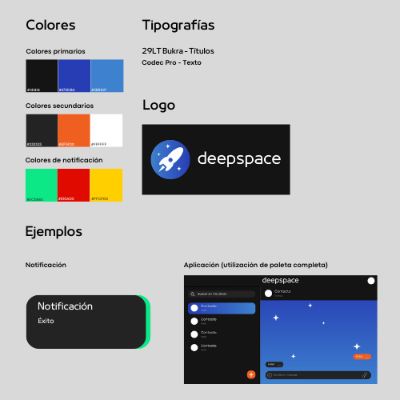
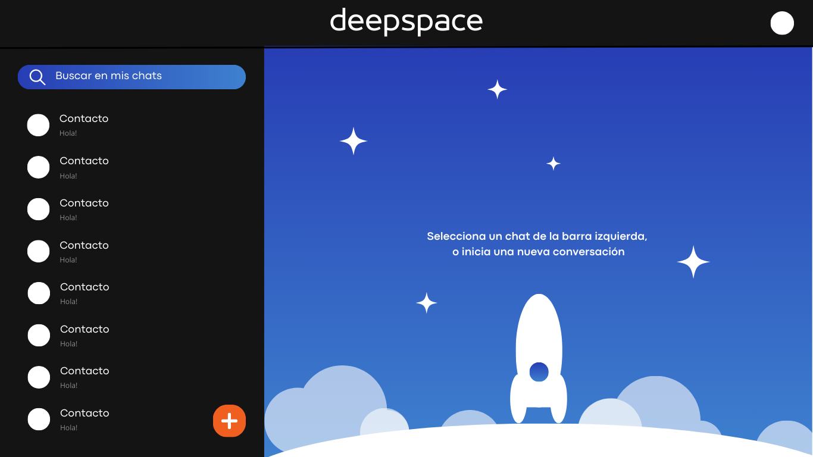
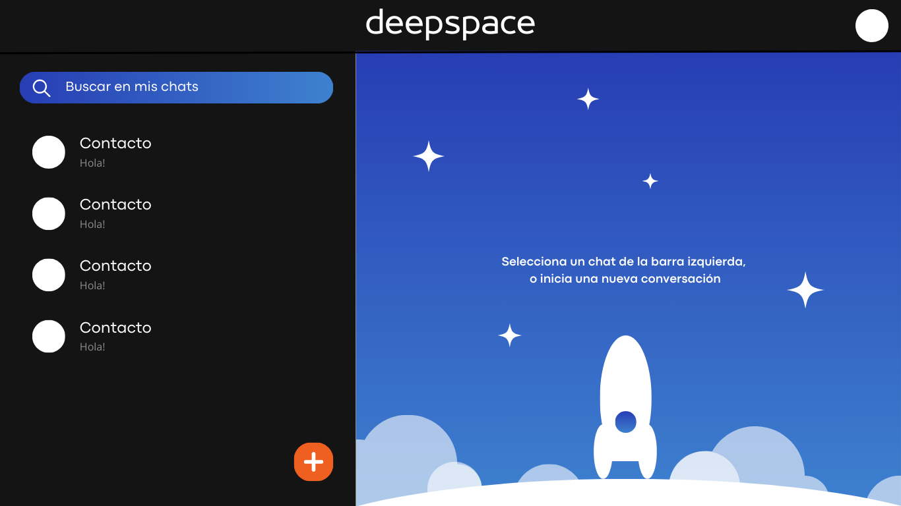
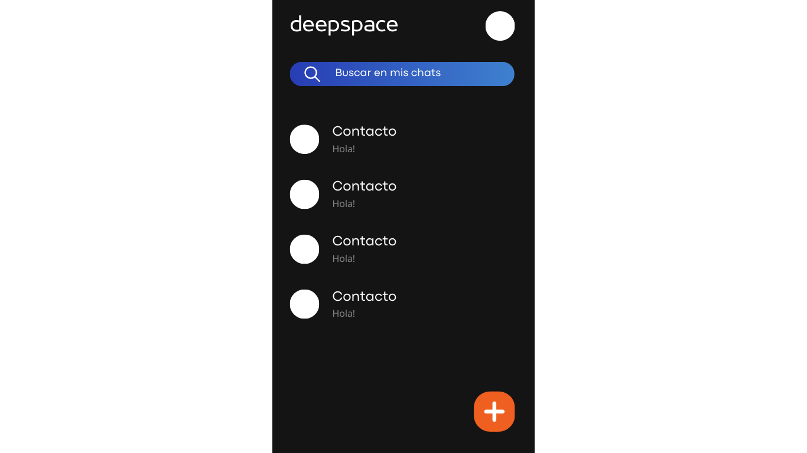
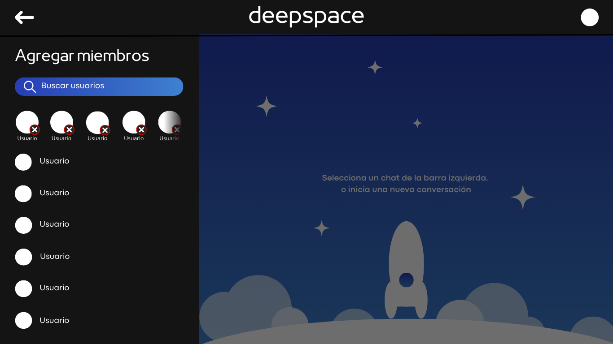
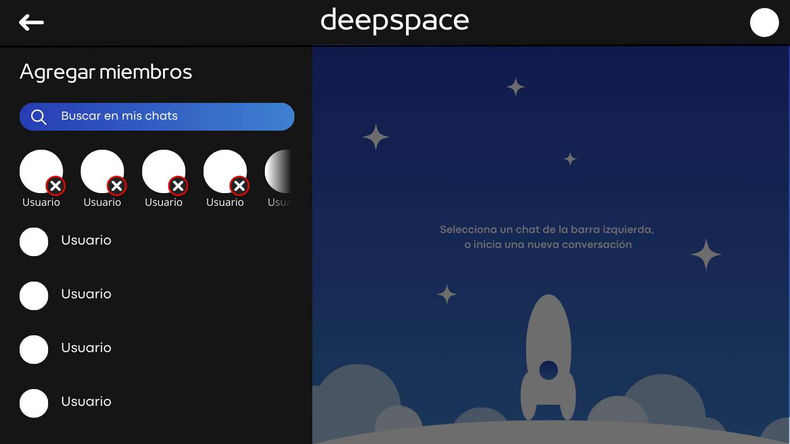
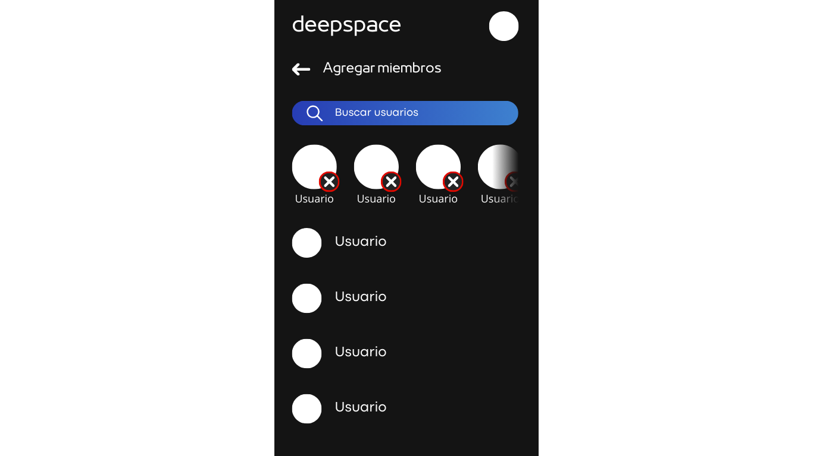
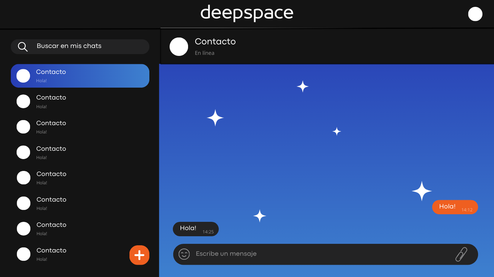
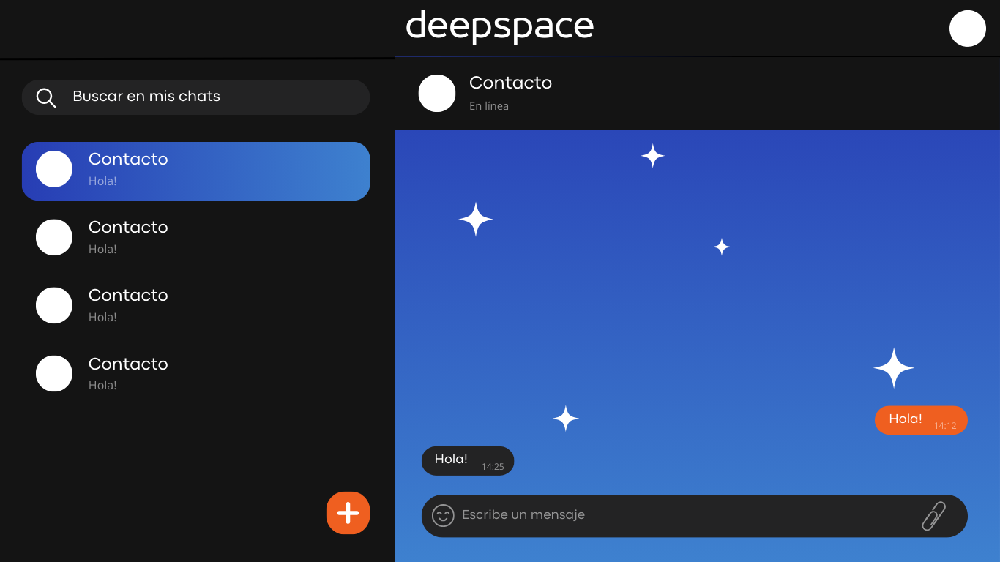
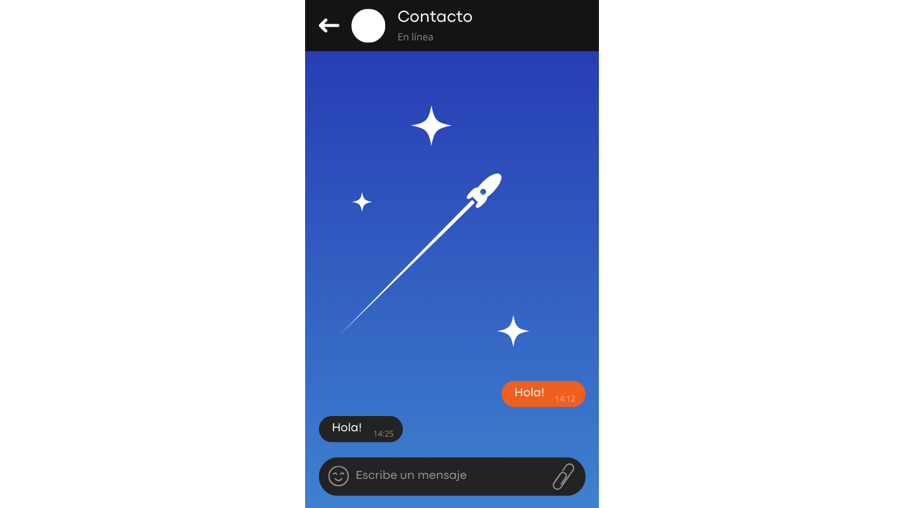

# E1 :construction:

* :pencil2: **Nombre Grupo:** React Madrid

* :link: **Sitio Web:** https://musical-mandazi-5f256e.netlify.app/

## Descripción general :thought_balloon:

- ¿De qué se tratará el proyecto?

El proyecto que vamos a desarrollar consiste en sistema de mensajería instantánea llamado "deepspace". En "deepspace" podrás comunicarte con una o muchas personas de manera simple, concisa y rápida. Se implementarán funciones como
login en la aplicación, crear e interactuar con chats individuales o grupales, recibir notificaciones, reportar mensajes inapropiados, mandar archivos, entre muchas otras cosas. 

También cuidaremos al usuario proporcionando una interfaz simple e intuitiva que además podrán modificar según sus necesidades. En línea con esto, "deepspace" podrá usarse desde un computador, una tableta o un celular, siendo accesible para todos los usuarios.

- ¿Cuál es el fin o la utilidad del proyecto?

El objetivo del proyecto es proporcionar una nueva plataforma de mensajería eficiente y personalizable que facilite la comunicación entre grupos e individuos de persona,s siendo "deepspace" una forma rápida y confiable de mantenerse en contacto, ya sea para fines de ocio, profesionales, comunitarios, etc.

- ¿Quiénes son los usuarios objetivo de su aplicación?

Los usuarios objetivo de "deepspace" son personas interesadas en la comunicación e interacción social. Estos usuarios son indistintos a factores como el género y la ubicación, y deben contar con acceso a internet. Pueden ser profesionales, estudiantes, grupos y organizaciones, personas que buscan su espacio para conversar sobre temas en común, entre muchos otros. 

## Historia de Usuarios :busts_in_silhouette:

1. Como visitante quiero poder registrarme para acceder a las funcionalidades del sitio.
    - Dado un visitante no registrado del sitio.
    - Cuando el visitante acceda a "Signup" e ingrese datos válidos como email, nombre, teléfono, etc.
    - Entonces el sitio lo registrará para acceso posterior.
2. Como usuario quiero poder ingresar para acceder a las funcionalidades del sitio que me corresponden.
    - Dado un usuario registrado en el sitio.
    - Cuando el usuario acceda a "Login" e ingrese sus credenciales válidas.
    - Entonces el sitio le dará la bienvenida al usuario y desbloquerá las funcionalidades del sitio a las que el usuario tiene acceso.
3. Como usuario quiero poder visualizar los chats para ver las interacciones más recientes con mis contactos.
    - Dado un usuario loggeado en el sitio.
    - Cuendo el usuario acceda a "Chats".
    - Entonces el sitio mostrará de forma general todos los chats de los que el usuario sea parte.
4. Como usuario quiero poder ingresar a un chat para ver los mensajes y potencialmente interactuar con el contacto/grupo.
    - Dado un usuario loggeado en la vista de chats.
    - Cuando el usuario seleccione uno de estos.
    - Entonces el sitio mostrará el historial de todos los mensajes y permitirá escribir uno nuevo.
5. Como usuario quiero poder enviar un mensaje para interactuar con un contacto/grupo.
    - Dado un usuario loggeado en la vista de un chat particular.
    - Cuando el usuario escriba texto o un emoji, o inserte una imagen, sobre el campo dedicado y presione "Enviar".
    - Entonces el sitio intentará enviar el mensaje.
        - En caso de éxito, el mensaje se agregará al historial y será visible en el chat.
        - En caso de error, se notificará al usuario que el mensaje no pudo ser enviado.
6. Como usuario quiero poder editar un mensaje enviado para corregir un error que pude haber cometido.
    - Dado un usuario loggeado en la vista de un chat particular, que ha enviado un mensaje recientemente.
    - Cuando el usuario haga click sobre "Editar" en el mensaje más reciente.
    - Entonces el sitio mostrará un campo dedicado similar al de *enviar un mensaje*.
    - Cuando el usuario corrija el mensaje y presione "Guardar".
    - Entonces el sitio intenterá modificar el mensaje enviado.
        - En caso de éxito, el mensaje será modificado y se marcará como que fue editado.
        - En caso de error, se notificará al usuario que el mensaje no pudo ser editado.

7.  Como usuario quiero poder eliminar un mensaje enviado para evitar que otros lo vean.
    - Dado un usuario loggeado en la vista de un chat particular, que ha enviado un mensaje recientemente.
    - Cuando el usuario haga click sobre "Eliminar" en uno de sus mensajes.
    - Entonces el sitio mostrará una confirmación para la eliminación del mensaje
    - Cuando el usuario confirme la eliminación.
    - Entonces el sitio intentará eliminar el mensaje.
        - En caso de éxito, el mensaje será eliminado y ya no será visible en el chat.
        - En caso de error, se notificará al usuario que el mensaje no pudo ser eliminado.
8. Como usuario quiero poder ver y actualizar mi perfil para mantener mi información actualizada.
    - Dado un usuario loggeado en su cuenta.
    - Cuando el usuario acceda a "Mi perfil".
    - Entonces el sitio mostrará la información actual del perfil (nombre, email, teléfono, foto de usuario, etc).
    - Cuando el usuario edite cualquier campo y presione "Guardar".
    - Entonces el sitio intentará actualizar la información del perfil.
        - En caso de éxito, la información será actualizada y se notificará al usuario.
        - En caso de error, se notificará al usuario que la información no pudo ser actualizada.

9. Como usuario quiero poder recibir notificaciones de mensajes nuevos para estar al tanto de las conversaciones.

- Dado un usuario loggeado.
- Cuando un nuevo mensaje sea recibido en cualquier chat donde el usuario es integrante.
- Entonces el sitio mostrará una notificación al usuario indicando el nuevo mensaje.
- Si el usuario hace click en la notificación.
- Entonces el sitio redirigirá al usuario al chat correspondiente donde el mensaje fue recibido.

10. Como usuario quiero poder crear un grupo de chat para conversar con múltiples personas a la vez.

- Dado un usuario loggeado.
- Cuando el usuario acceda a "Nuevo grupo" y especifique los detalles del grupo (nombre del grupo, miembros, foto de grupo).
- Entonces el sitio intentará crear el grupo de chat.
    - En caso de éxito, el grupo será creado y los miembros serán notificados.
    - En caso de error, se notificará al usuario que el grupo no pudo ser creado.

11. Como usuario quiero poder cambiar mi contraseña para ingresar a mi cuenta en caso de haberla olvidado.

- Dado un usuario registrado en el sitio con la sesión cerrada.
- Cuando el usuario intente ingresar a su cuenta y acceda a "Olvide mi contraseña".
- Entonces el sitio mostrará un campo para ingresar el correo
- Cuando el usuario ingrese su correo y le de a "Continuar"
- Entonces se enviara un correo con un link de confirmación para el cambio de contraseña.
- Cuando el usuario abra este link.
- Entonces la aplicación permitirá al usuario escribir una nueva contraseña y el sitio intentará cambiarla.
    - En caso de éxito, la contraseña será actualizada y se notificará al usuario.
    - En caso de error, se notificará al usuario que la contraseña no pudo ser cambiada.

12. Como usuario quiero poder reportar mensajes inapropiados para que los administradores puedan revisarlos.

- Dado un usuario loggeado en la vista de un chat particular.
- Cuando el usuario seleccione un mensaje y elija "Reportar".
- Entonces el sitio enviará un reporte a los administradores para su revisión.
    - En caso de éxito, se notificará al usuario que el reporte fue enviado.
    - En caso de error, se notificará al usuario que no se pudo enviar el reporte.

13. Como usuario quiero poder buscar mensajes dentro de un chat para encontrar información específica.

- Dado un usuario loggeado en la vista de un chat particular.
- Cuando el usuario acceda a la función de búsqueda y escriba algo.
- Entonces el sitio mostrará todos los mensajes de ese chat que coincidan con lo escrito.

14. Como usuario quiero poder silenciar las notificaciones de un chat para no recibir alertas.

- Dado un usuario loggeado en la vista de un chat particular.
- Cuando el usuario acceda a la configuración del chat y seleccione la opción de "Silenciar Notificaciones".
- Entonces el sitio silenciará las notificaciones de ese chat.
    - En caso de éxito, se notificará al usuario que las notificaciones fueron silenciadas.
    - En caso de error, se notificará al usuario que no se pudo silenciar el chat.

15. Como usuario quiero poder adjuntar archivos en un chat para compartir documentos o imágenes.

- Dado un usuario loggeado en la vista de un chat particular.
- Cuando el usuario haga click en el icono de "Adjuntar" y seleccione un archivo desde su dispositivo.
- Entonces el sitio intentará enviar el archivo adjunto.
    - En caso de éxito, el archivo será enviado y visible en el chat.
    - En caso de error, se notificará al usuario que el archivo no pudo ser enviado.

16. Como usuario quiero poder fijar un chat para poder verlos siempre en la parte superior de la lista.

- Dado un usuario loggeado en la vista de Chats.
- Cuando el usuario selecciona un chat y seleccione la opción de "Fijar chat".
- Entonces el sitio fijará el chat en la parte superior de los demás chats.
    - En caso de éxito, el chat aparecerá en la parte superior de la lista y se notificará al usuario.
    - En caso de error, se notificará al usuario que el chat no pudo ser fijado.

## Diagrama Entidad-Relación :scroll:
<!-- Insertamos la imagen ER-Model.png -->

## Diseño Web :computer:

<!-- Documento de diseño web -->
### :art: Documento de diseño

<!-- Vistas principales -->
### :mag: Vistas principales

#### Vista usuario: Chats

#### Vista usuario: Crear grupo

#### Vista usuario: Chat (singular)

#### Web icon

#### Web URL
[Visit our website](https://www.example.com)